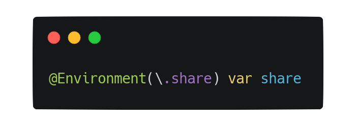

    

# Share @Environment Example

An example project for [Custom @Environment value for share actions](https://blog.artemnovichkov.com/editor/custom-environment-value-for-share-actions) article.

## Author

Artem Novichkov, mail@artemnovichkov.com

## License

The project is available under the MIT license. See the [LICENSE](./LICENSE) file for more info.
